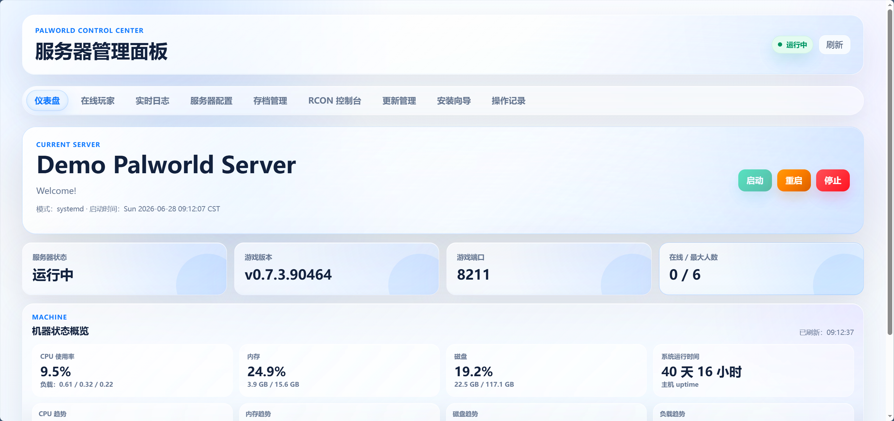
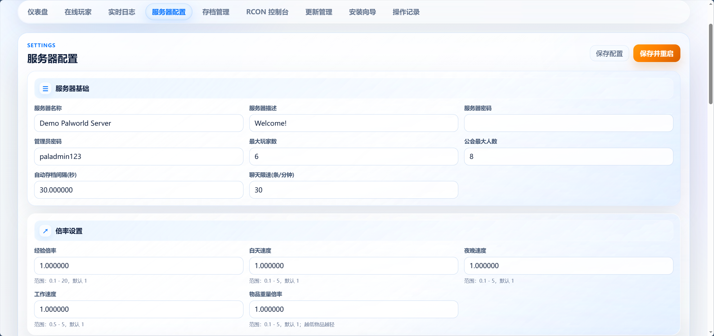
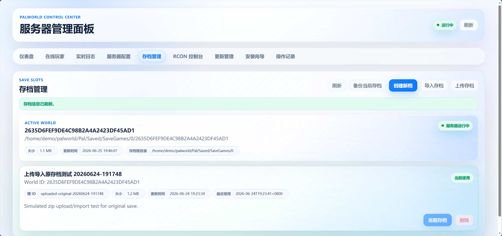
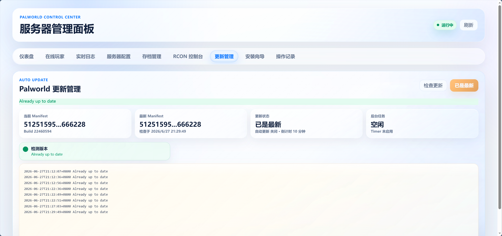
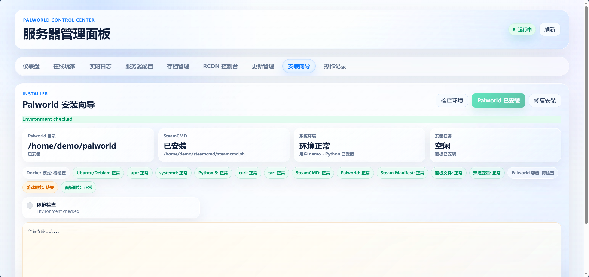

# Palworld Server Panel

[](https://github.com/tsd-12356/palworld-server-panel/actions/workflows/ci.yml)
[](LICENSE)
[](docs/DOCKER.md)
[](requirements.txt)
[](docs/releases/v0.1.0-beta.md)

一个面向 Palworld Dedicated Server 的现代 Web 管理面板。主打 **自动化、省心运维、浅色毛玻璃 UI**：支持 Docker Compose 一键部署、服务器自动安装向导、存档管理、配置编辑、RCON、日志、机器状态、手动更新和操作审计，适合个人服务器、朋友服和内网运维。

> 当前项目默认不带登录系统，请放在内网、Tailscale、ZeroTier 或可信反代后使用。

## 为什么选它

- **部署省心**：推荐 Docker Compose 一键启动，也保留 Ubuntu/Debian 原生 systemd 安装器。
- **安装省心**：内置安装向导，可检查环境、安装/修复 Palworld、SteamCMD、systemd 服务和权限。
- **更新省心**：支持手动检测版本、后台触发更新，更新日志和状态直接在面板里看。
- **存档省心**：支持备份、上传 zip 导入、创建新世界、切换存档、删除存档。
- **配置省心**：可视化编辑 `PalWorldSettings.ini`，保存前显示差异确认，保存并重启有步骤反馈。
- **面板好看**：浅色玻璃拟态、星尘粒子、鼠标光斑、卡片动效，比传统黑框面板更舒服。
- **功能够完整**：状态、在线玩家、日志、配置、RCON、存档、更新、审计、机器监控都在一个页面里。
- **运维可追踪**：操作记录会写入审计日志，方便回看谁做了什么。
- **轻量易维护**：不依赖 npm/Vite/Tailwind，Flask + 原生 CSS/JS，部署和二次开发都更直接。

## 界面预览



| 可视化配置 | 存档管理 |
| --- | --- |
|  |  |

| 手动更新 | 安装向导 |
| --- | --- |
|  |  |

## 省心自动化

- **首次部署自动化**：Docker 模式首次启动会自动安装 SteamCMD 和 Palworld Dedicated Server。
- **环境检查自动化**：安装向导会检查 apt、systemd、Python、curl、tar、SteamCMD、Palworld、环境变量和服务状态。
- **配置操作自动化**：保存配置前显示字段差异，保存并重启会展示“保存配置 -> 重启服务 -> 等待恢复 -> 刷新状态”。
- **存档操作自动化**：切换存档会自动停止服务、备份当前存档、替换存档、修复权限、启动服务。
- **更新流程自动化**：手动检测 manifest，确认后后台执行更新流程，日志和结果保留在面板里。
- **运维审计自动化**：启动、停止、重启、配置保存、RCON、存档操作都会进入操作记录。

## 核心功能

| 分类 | 功能 |
| --- | --- |
| 服务器控制 | 启动、停止、重启、运行状态、在线玩家 |
| 配置管理 | 可视化修改 `PalWorldSettings.ini`、差异确认、保存并重启 |
| 存档管理 | 备份、上传 zip 导入、创建新档、切换、删除 |
| 日志与 RCON | 实时日志、RCON 控制台、命令结果分层展示 |
| 机器状态 | CPU、内存、磁盘、负载、运行时间、迷你趋势图 |
| 更新管理 | 手动检测更新、手动触发后台更新 |
| 安装向导 | 环境检查、Palworld 安装、SteamCMD 检查、权限/服务修复 |
| 操作审计 | 记录启动/停止/重启、配置保存、RCON、存档操作 |
| 部署方式 | Docker Compose 推荐部署，systemd 原生部署保留 |

## 推荐部署：Docker Compose

适合大多数开源用户。

```bash
git clone https://github.com/tsd-12356/palworld-server-panel.git
cd palworld-server-panel
cp .env.example .env
```

编辑 `.env`，至少修改：

```env
RCON_PASSWORD=change-this-password
PANEL_SECRET_KEY=change-this-secret
```

启动：

```bash
docker compose up -d --build
```

访问：

```text
http://服务器IP:8080
```

首次启动时，`palworld` 容器会自动安装 SteamCMD 和 Palworld Dedicated Server，耗时取决于网络和磁盘速度。

更多说明见 [Docker 部署文档](docs/DOCKER.md)。

## 原生 Ubuntu/Debian 部署

适合直接部署在 VPS 上，使用 systemd 管理服务。

```bash
git clone https://github.com/tsd-12356/palworld-server-panel.git
cd palworld-server-panel
sudo bash install.sh
```

更多说明见 [systemd 部署文档](docs/SYSTEMD.md)。

## 数据目录

Docker 模式默认使用：

```text
data/palworld  # Palworld 服务端、配置、存档
data/steamcmd  # SteamCMD
data/panel     # 面板日志、审计、存档槽、状态文件
```

原生模式默认使用：

```text
/home/demo/palworld
/home/demo/steamcmd
/home/demo/palworld-panel
/etc/palworld-panel.env
```

## 常用命令

Docker：

```bash
docker compose ps
docker compose logs -f palworld
docker compose logs -f panel
docker compose restart palworld
docker compose down
```

原生 systemd：

```bash
systemctl status palworld-panel.service
systemctl status palworld.service
journalctl -u palworld-panel.service -f
journalctl -u palworld.service -f
```

## 安全说明

- 面板不自带登录，请只放在可信网络内。
- Docker 模式会挂载 `/var/run/docker.sock`，面板只控制 `.env` 中指定的 Palworld 容器。
- 原生模式使用受限 sudoers，只允许固定的 systemd、journalctl 和必要 chown 操作。
- 不要把 `.env`、`/etc/palworld-panel.env`、存档目录和审计日志提交到公开仓库。

更多见 [安全说明](docs/SECURITY.md)。

## 适合谁使用

- 想给朋友服、家庭服、内网服搭一个好看面板。
- 希望少写命令，通过网页完成启动、停止、重启、配置、存档和更新。
- 希望用 Docker Compose 快速部署，也希望保留原生 systemd 部署选择。
- 已经有 Tailscale、ZeroTier、内网或可信反代作为访问边界。

如果你要把面板直接暴露到公网，请先自行加登录、访问控制或反向代理鉴权。

## 文档入口

- [Docker 部署](docs/DOCKER.md)
- [Ubuntu/Debian 原生部署](docs/SYSTEMD.md)
- [常见问题](docs/FAQ.md)
- [安全说明](docs/SECURITY.md)
- [Roadmap](ROADMAP.md)
- [v0.1.0-beta 发布说明](docs/releases/v0.1.0-beta.md)

## 版本状态

- systemd 模式已在真实服务器验证。
- Docker Compose 是推荐部署方式，当前版本为 beta，建议首次部署时先观察 `palworld` 容器日志，确认服务端下载和启动完成。
- 面板默认不包含登录系统，适合自用、内网、Tailscale、ZeroTier 或可信反代环境。
- 欢迎通过 Issue 反馈 Docker 部署、systemd 安装、存档管理、配置编辑或 UI 体验问题。

## License

MIT
