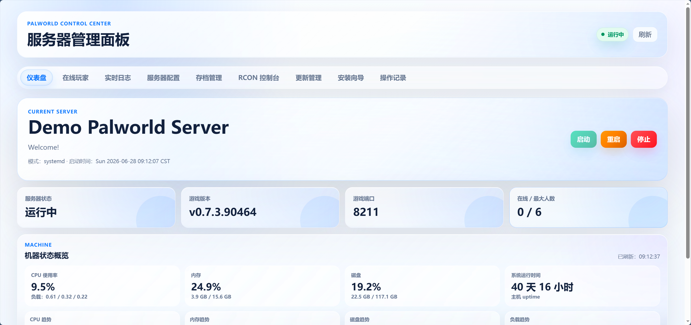
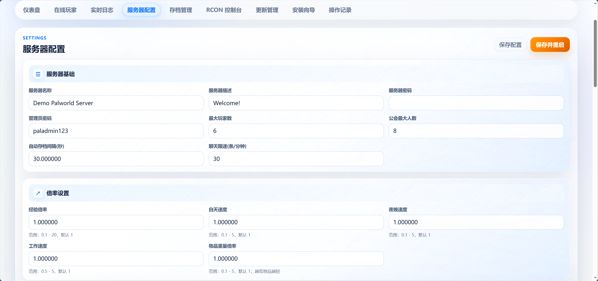
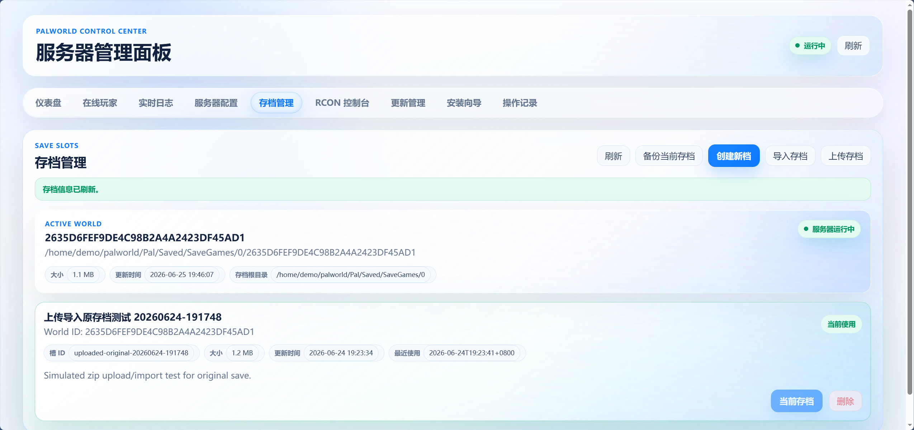
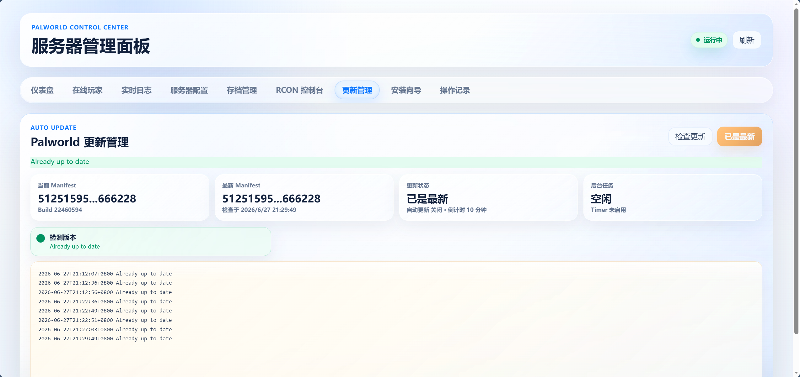
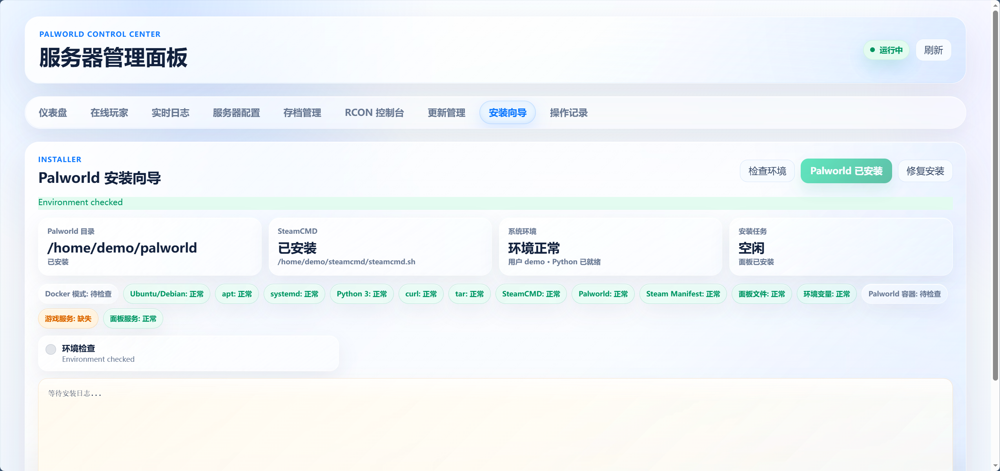

# Palworld Server Panel

[简体中文](README.md) | [English](README_EN.md)

[](https://github.com/tsd-12356/palworld-server-panel/actions/workflows/ci.yml)
[](LICENSE)
[](docs/DOCKER.md)
[](requirements.txt)
[](docs/releases/v2.0.1.md)

A modern web panel for managing a Palworld Dedicated Server. It focuses on **automation, low-maintenance operations, and a light glassmorphism UI**. Features include one-command Docker Compose deployment, an installation wizard, save management, visual configuration, RCON, logs, host monitoring, manual updates, audit history, and experimental mod management. It is designed for personal servers, friends-only servers, and private-network administration.

> The panel does not include authentication by default. Run it only on a private network or behind Tailscale, ZeroTier, or a trusted authenticated reverse proxy.

## Why Use It

- **Straightforward deployment**: Docker Compose is the recommended option, with a native Ubuntu/Debian systemd installer also available.
- **Guided installation**: The built-in wizard checks the environment and installs or repairs Palworld, SteamCMD, systemd services, and permissions.
- **Reliable updates**: Check for updates and start background updates from the panel, with stale manifest recovery, interrupted-download resumption, and visible status and logs.
- **Save management**: Create backups, import ZIP archives, create worlds, switch save slots, and delete saves.
- **Experimental mod support**: Since 2.0, upload `.pak`, `.sig`, and `.zip` files; enable or disable mods; move them to trash; empty trash; and apply changes with a restart. Empty files, scripts, and high-risk archive contents are rejected.
- **Visual configuration**: Edit `PalWorldSettings.ini` through a form, review changes before saving, and follow the save-and-restart progress.
- **Modern interface**: A light glassmorphism design with subtle particles, pointer lighting, and card motion instead of a traditional terminal-style panel.
- **Complete operations view**: Server status, online players, logs, configuration, RCON, saves, updates, audit history, and host monitoring are available on one page.
- **Auditable operations**: Administrative actions are written to an audit log.
- **Easy to maintain**: No npm, Vite, or Tailwind build is required. The application uses Flask with native CSS and JavaScript.

## Screenshots



| Visual Configuration | Save Management |
| --- | --- |
|  |  |

| Manual Updates | Installation Wizard |
| --- | --- |
|  |  |

## Automation

- **First-run setup**: In Docker mode, the Palworld container installs SteamCMD and Palworld Dedicated Server on its first start.
- **Environment checks**: The installation wizard checks apt, systemd, Python, curl, tar, SteamCMD, Palworld, environment variables, and service state.
- **Configuration workflow**: Before saving, the panel shows changed fields. Save-and-restart displays each step from writing the configuration through service recovery.
- **Save switching**: The panel stops the server, backs up the active save, replaces it, fixes permissions, and starts the server again.
- **Mod workflow**: Uploads are classified as PAK files or official `Info.json` packages. The panel can back up and restart after enabling or disabling a mod. Compatibility still depends on the game version, host platform, and mod implementation.
- **Update workflow**: The panel compares Steam depot manifests and runs updates in the background. SteamCMD uses TCP mode, backs up and refreshes rejected manifests, and resumes interrupted updates after a container restart.
- **Audit trail**: Start, stop, restart, configuration, RCON, and save actions are recorded.

## Features

| Category | Features |
| --- | --- |
| Server control | Start, stop, restart, runtime state, online players |
| Configuration | Visual `PalWorldSettings.ini` editing, change confirmation, save and restart |
| Saves | Backup, ZIP import, new world creation, slot switching, deletion |
| Mods | Experimental `.pak/.sig/.zip` upload, enable, disable, trash, cleanup, apply and restart; unsafe content rejection |
| Logs and RCON | Live logs, RCON console, structured command results |
| Host monitoring | CPU, memory, disk, load, uptime, compact trend charts |
| Updates | Manual update checks and background update execution |
| Installation wizard | Environment checks, Palworld installation, SteamCMD checks, permission and service repair |
| Audit history | Start, stop, restart, configuration, RCON, and save-operation records |
| Deployment | Recommended Docker Compose deployment and optional native systemd deployment |

## Recommended Deployment: Docker Compose

This is the recommended deployment method for most users.

```bash
git clone https://github.com/tsd-12356/palworld-server-panel.git
cd palworld-server-panel
cp .env.example .env
```

Edit `.env` and set at least these values:

```env
RCON_PASSWORD=change-this-password
PANEL_SECRET_KEY=change-this-secret
```

Start the services:

```bash
docker compose up -d --build
```

The panel binds to `127.0.0.1:8080` on the host by default. Access it through a reverse proxy on the same host, an SSH tunnel, or Tailscale Funnel/Serve. Example Nginx location block:

```nginx
location / {
    proxy_pass http://127.0.0.1:8080;
    proxy_set_header Host $host;
    proxy_set_header X-Real-IP $remote_addr;
    proxy_set_header X-Forwarded-For $proxy_add_x_forwarded_for;
    proxy_set_header X-Forwarded-Proto $scheme;
}
```

On the first start, the `palworld` container installs SteamCMD and Palworld Dedicated Server. The required time depends on network and disk performance.

See the [Docker deployment guide](docs/DOCKER.md) for details.

## Native Ubuntu/Debian Deployment

Use this option to deploy directly on a VPS with systemd-managed services.

```bash
git clone https://github.com/tsd-12356/palworld-server-panel.git
cd palworld-server-panel
sudo bash install.sh
```

See the [systemd deployment guide](docs/SYSTEMD.md) for details.

## Data Directories

Docker mode uses these persistent paths by default:

```text
data/palworld  # Palworld server files, configuration, and saves
data/steamcmd  # SteamCMD
data/panel     # Panel logs, audit data, save slots, and status files
```

Mod data is also stored in persistent directories:

```text
data/palworld/Pal/Content/Paks/~mods  # Enabled PAK/SIG files
data/panel/mod-library                # Disabled files, import metadata, and trash
```

Native mode uses these paths by default:

```text
/home/demo/palworld
/home/demo/steamcmd
/home/demo/palworld-panel
/etc/palworld-panel.env
```

## Common Commands

Docker:

```bash
docker compose ps
docker compose logs -f palworld
docker compose logs -f panel
docker compose restart palworld
docker compose down
```

Native systemd:

```bash
systemctl status palworld-panel.service
systemctl status palworld.service
journalctl -u palworld-panel.service -f
journalctl -u palworld.service -f
```

## Security

- The panel has no built-in login system. Keep it on a trusted network.
- Docker mode mounts `/var/run/docker.sock`. The panel restricts itself to the Palworld container configured in `.env`, but access to the Docker socket is inherently privileged.
- Native mode installs restricted sudoers rules for specific systemd, journalctl, and required chown operations.
- Never commit `.env`, `/etc/palworld-panel.env`, save data, or audit logs to a public repository.

See the [security guide](docs/SECURITY.md) for more information.

## Intended Users

- People who want a modern panel for a personal, family, or friends-only Palworld server.
- Administrators who prefer performing start, stop, restart, configuration, save, and update operations from a browser.
- Users who want quick Docker Compose deployment while retaining a native systemd option.
- Environments already protected by a private network, Tailscale, ZeroTier, or a trusted reverse proxy.

If you intend to expose the panel to the public internet, add authentication and access control at the reverse proxy first.

## Documentation

- [Docker deployment](docs/DOCKER.md)
- [Native Ubuntu/Debian deployment](docs/SYSTEMD.md)
- [Mod management](docs/MODS.md)
- [FAQ](docs/FAQ.md)
- [Security](docs/SECURITY.md)
- [Roadmap](ROADMAP.md)
- [v2.0.1 release notes](docs/releases/v2.0.1.md)
- [v2.0.0 release notes](docs/releases/v2.0.0.md)
- [v0.1.0-beta release notes](docs/releases/v0.1.0-beta.md)

## Project Status

- The systemd deployment has been validated on a real server.
- Docker Compose is the recommended deployment method. The project is currently in beta; on first deployment, monitor the `palworld` container logs until the server download and startup complete.
- Mod management is experimental in 2.0. Upload, enable, disable, delete, trash cleanup, and official `Info.json` ZIP import flows have been tested, but individual mod compatibility on Linux or Docker must be verified against the mod author's instructions.
- The panel does not include authentication and is intended for personal use, private networks, Tailscale, ZeroTier, or trusted reverse proxies.
- Issues covering Docker deployment, systemd installation, save management, configuration, and UI behavior are welcome.

## License

MIT
